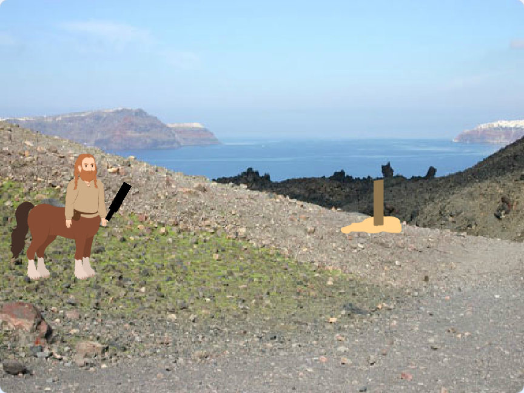

## What you will make

In Jukskei, players try to knock over a wooden peg by throwing a skey at it. It takes skill, aim, and timing. That’s what your Scratch game will test!

--- print-only ---

--- /print-only ---

--- no-print ---

Play the finished game.

- Press `N` to start a new game!
- Press `T` to start a new throw
- Press `SPACE` to select power and throw

 <iframe allowtransparency="true" width="485" height="402" src="https://scratch.mit.edu/projects/embed/1177312843/?autostart=false" frameborder="0"></iframe>

--- /no-print ---

