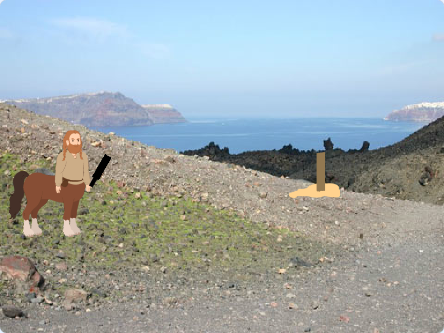

## Ce que tu vas faire

Au Jukskei, les joueurs tentent de renverser un piquet en bois en lui lançant un skei. Cela demande de l'habileté, de la précision et du timing. C’est exactement ce que ton jeu Scratch va mettre à l’épreuve !

--- print-only ---

--- /print-only ---

--- no-print ---

Joue au jeu terminé.

- Appuie sur `N` pour démarrer une nouvelle partie !
- Appuie sur `T` pour commencer un nouveau lancer
- Appuie sur `ESPACE` pour sélectionner la puissance et lancer

 <iframe allowtransparency="true" width="485" height="402" src="https://scratch.mit.edu/projects/embed/1202448413/?autostart=false" frameborder="0"></iframe>

--- /no-print ---

