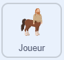

## Animer le sprite Joueur

\--- task ---

Ouvre le [projet de démarrage](https://scratch.mit.edu/projects/1202448566/editor/){:target="_blank"}.

\--- /task ---

Le projet de démarrage contient le code initial et tous les sprites nécessaires.

\--- task ---

Sélectionne le sprite **Joueur**. {:width="100px"}

\--- /task ---

### Lancer !

Anime le joueur avec un mouvement de lancer.

\--- task ---

Dans le bloc `quand je reçois`{:class="block3events"}, change le costume.

```blocks3
+when I receive [throw v]
+switch costume to [throw v]
+wait (1) seconds
+switch costume to [still v]
```

\--- /task ---

\--- task ---

**Test :**

- Appuie sur `N` pour démarrer une nouvelle partie, puis sur `T` pour effectuer un nouveau lancer. Vérifie que la barre de puissance affiche des cycles de 0 à 100.
  Le skei ne bougera pas encore.

- Appuie sur `ESPACE` pour arrêter la barre de puissance. Vérifie que le sprite Joueur change de costume pour le costume lancer, puis revient à son costume immobile.

\--- /task ---
