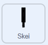

## Le sprite Skei

--- task ---

Sélectionne le sprite **Skei**. {:width="100px"}

--- /task ---

### Déplacer vers le piquet

Définis la position initiale du skei.

--- task ---

```blocks3
+when I receive [lancer v]
+go to x: (-127) y: (29)
+set rotation style [à 360° v]
+point towards (Piquet v)
+start sound (Siren Whistle v)
```

--- /task ---

Lance le skei en décrivant un arc dans les airs.

--- task ---

```blocks3
when I receive [lancer v]
go to x: (-127) y: (29)
set rotation style [à 360° v]
point towards (Piquet v)
start sound (Siren Whistle v)
+repeat until <(distance to (Piquet v)) < (Atterrissage x)> // < signifie "moins que"
  turn cw (15) degrees
  move (10) steps
  point towards (Piquet v)
end
+start sound (Whistle Thump v)
+wait (0.5) seconds
```

--- /task ---

--- task ---

**Test :** appuie sur `T`. Vérifie que le skei se déplace dans les airs en décrivant un arc et que les sons de lancer et d’atterrissage sont bien joués.

--- /task ---

### Réinitialiser

Réinitialise la position du skei après son atterrissage.

--- task ---

```blocks3
when I receive [lancer v]
go to x: (-127) y: (29)
set rotation style [à 360° v]
point towards (Piquet v)
start sound (Siren Whistle v)
repeat until <(distance to (Piquet v)) < (Atterrissage x)>
  turn cw (15) degrees
  move (10) steps
  point towards (Piquet v)
end
start sound (Whistle Thump v)
wait (0.5) seconds
+go to x: (-136) y: (-11)
+point in direction (120)
```

--- /task ---

### Déclenchement du score

Ajoute un message de diffusion pour déclencher le calcul du score.

--- task ---

```blocks3
when I receive [lancer v]
go to x: (-127) y: (29)
set rotation style [à 360° v]
point towards (Piquet v)
start sound (Siren Whistle v)
repeat until <(distance to (Piquet v)) < (Atterrissage x)>
  turn cw (15) degrees
  move (10) steps
  point towards (Piquet v)
end
start sound (Whistle Thump v)
wait (0.5) seconds
go to x: (-136) y: (-11)
point in direction (120)
+broadcast (score v)
```

--- /task ---
