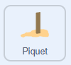

## Score sur le piquet

--- task ---

Sélectionne le sprite **Piquet**. {:width="100px"}

--- /task ---

### Modifier le score

Le skei obtient plus de points s'il atterrit plus près du piquet.

--- task ---

```blocks3
+when I receive [score v] // Reçoit le message de diffusion précédemment.
+change [Lancers restants v] by (-1)
+change [Score v] by ((120) - (Atterrissage x))
+set [Puissance v] to (0)
```

--- /task ---

--- task ---

**Test :** appuie sur `T`. Vérifie que le score augmente, que le nombre de lancers diminue de 1 et que la puissance est réinitialisée.

--- /task ---

### Afficher le score

Lorsqu'il ne reste plus de lancers, affiche le score, puis réinitialise les lancers et le score.

--- task ---

**Remarque** : il y a un espace après le mot « Score : » pour séparer le score du mot.

```blocks3
when I receive [score v]
change [Lancers restants v] by (-1)
change [Score v] by ((120) - (Atterrissage x))
set [Puissance v] to (0)
+if <(Lancers restants) = (0)> then
	say (join [Score: ] (Score)) for (2) seconds
	set [Lancers restants v] to (3)
	set [Score v] to (0)
else
```

--- /task ---

### Dire au joueur de relancer

--- task ---

```blocks3
when I receive [score v]
change [Lancers restants v] by (-1)
change [Score v] by ((120) - (Atterrissage x))
set [Puissance v] to (0)
if <(Lancers restants) = (0)> then
	say (join [Score: ] (Score)) for (2) seconds
	set [Lancers restants v] to (3)
	set [Score v] to (0)
else
+	say [Appuie sur T pour le prochain lancer] for (1) seconds
end
+stop [ce script v]
```

--- /task ---

--- task ---

**Test :** appuie de nouveau sur `T`.

- S'il reste des lancers, vérifie si une invite apparaît pour continuer.
- S'il ne reste plus de lancers, vérifie que le score est affiché, puis que les lancers et le score sont réinitialisés.

--- /task ---
