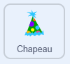

## Défi

### Ajoute une célébration !

Ajoute un chapeau de fête et joue une mélodie lorsqu'un score est atteint !

\--- task ---

Sélectionne le sprite **Chapeau**. {:width="100px"}

\--- /task ---

\--- task ---

Lorsqu'un score supérieur à (`>`) 200 est atteint, le sprite Chapeau apparaîtra et un son sera joué.

```blocks3
+when I receive [score v]
+forever
	if <(Score) > (200)> then // Try changing this score
    	show                              	
    	play sound [Dubstep v] until done 	// You can change the sound
	end
end
```

\--- /task ---

\--- task ---

Ajoute le code de réinitialisation.

```blocks3
+when [n v] key pressed
+hide
```

\--- /task ---

\--- task ---

**Test :** appuie sur `N` et joue jusqu'à un score supérieur à 200, puis vérifie que le chapeau s'affiche et que tu entends le son choisi.

\--- /task ---

### Afficher les commandes du jeu

\--- task ---

Sélectionne la scène et ouvre l'onglet « Arrière-plans ».

\--- /task ---

\--- task ---

Duplique l'arrière-plan Colline et renomme-le « Commandes ».

\--- /task ---

\--- task ---

Ajoute du texte à l'arrière-plan des commandes pour indiquer comment contrôler le jeu.

\--- /task ---

\--- task ---

Ajoute ce bloc de code unique au script « quand la touche n est pressée ».

```blocks3
when [n v] key pressed
stop all sounds
set [Score v] to [0]
set [Power v] to [0]
set [Throws left v] to [3]
+switch backdrop to [Hill v]
show variable [Power v]
show variable [Score v]
show variable [Throws left v]
```

\--- /task ---

### Choisir un autre sprite Joueur

\--- task ---

Choisis le sprite Joueur et sélectionne un nouveau sprite dans la bibliothèque, crée le tien, télécharge une image ou sélectionnes-en un au hasard.

\--- /task ---

\--- task ---

Assure-toi que ton nouveau sprite possède deux costumes : « lancer » et « immobile » pour conserver l’animation de lancer.

\--- /task ---
