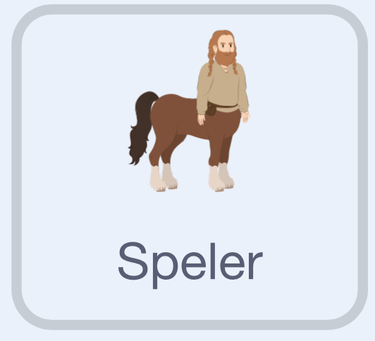

## Animeer de speler-sprite

--- task ---

Open het [startproject](https://scratch.mit.edu/projects/1274585648/editor/){:target="_blank"}.

--- /task ---

Het startproject bevat code om mee te starten en alle sprites die je nodig hebt.

--- task ---

Selecteer de **Speler**-sprite. {:width="100px"}

--- /task ---

### Gooien!

Animeer de speler met een werpbeweging.

--- task ---

In het `wanneer ik signaal ontvang`{:class="block3events"} blok, verander je het uiterlijk.

```blocks3
+when I receive [worp v]
+switch costume to [worp v]
+wait (1) seconds
+switch costume to [stilstaan v]
```

--- /task ---

--- task ---

**Test:**

- Druk op `N` om een nieuw spel te starten, en vervolgens op `T` om een nieuwe worp te starten. Controleer de laadcyclus van de batterij van 0 tot 100.
  De skey zal nog niet bewegen.

- Druk op de spatiebalk om de batterij te stoppen. Controleer of de Speler-sprite van uiterlijk verandert naar het worp-uiterlijk en vervolgens weer terugkeert naar het stilstaan-uiterlijk.

--- /task ---
