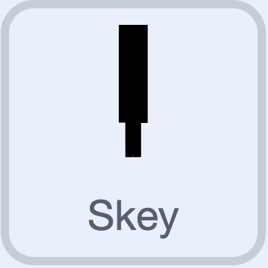

## De skey-sprite

--- task ---

Selecteer de **Skey**-sprite. {:width="100px"}

--- /task ---

### Beweging naar de pin

Stel de beginpositie van de skey in.

--- task ---

```blocks3
+when I receive [throw v]
+go to x: (-127) y: (29)
+set rotation style [all around v]
+point towards (Peg v)
+start sound (Siren Whistle v)
```

--- /task ---

Laat de skey in een boog door de lucht bewegen.

--- task ---

```blocks3
when I receive [throw v]
go to x: (-127) y: (29)
set rotation style [all around v]
point towards (Peg v)
start sound (Siren Whistle v)
+repeat until <(distance to (Peg v)) < (Landing x)> // < means 'less than'
  turn cw (15) degrees
  move (10) steps
  point towards (Peg v)
end
+start sound (Whistle Thump v)
+wait (0.5) seconds
```

--- /task ---

--- task ---

**Test:** Druk op 'T'. Controleer of de skey in een boog door de lucht beweegt en of de geluiden van het gooien en landen hoorbaar zijn.

--- /task ---

### Resetten

Zet de skey terug in de juiste positie nadat deze is geland.

--- task ---

```blocks3
when I receive [throw v]
go to x: (-127) y: (29)
set rotation style [all around v]
point towards (Peg v)
start sound (Siren Whistle v)
repeat until <(distance to (Peg v)) < (Landing x)>
  turn cw (15) degrees
  move (10) steps
  point towards (Peg v)
end
start sound (Whistle Thump v)
wait (0.5) seconds
+go to x: (-136) y: (-11)
+point in direction (120)
```

--- /task ---

### Score activeren

Voeg een bericht toe om de score te activeren.

--- task ---

```blocks3
when I receive [throw v]
go to x: (-127) y: (29)
set rotation style [all around v]
point towards (Peg v)
start sound (Siren Whistle v)
repeat until <(distance to (Peg v)) < (Landing x)>
  turn cw (15) degrees
  move (10) steps
  point towards (Peg v)
end
start sound (Whistle Thump v)
wait (0.5) seconds
go to x: (-136) y: (-11)
point in direction (120)
+broadcast (score v)
```

--- /task ---
