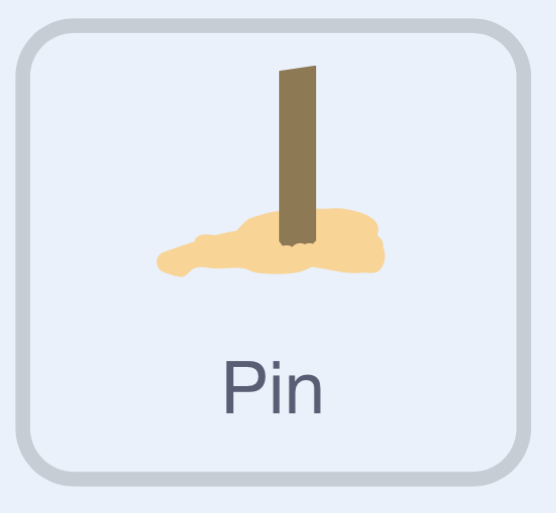

## Scoren op de pin

\--- task ---

Selecteer de **Pin**-sprite. {:width="100px"}

\--- /task ---

### Wijzig de score

De skey krijgt meer punten als hij dichter bij de pin terechtkomt.

\--- task ---

```blocks3
+when I receive [score v] // Receive the broadcast message from before. 
+change [Throws left v] by (-1)
+change [Score v] by ((120) - (Landing x))
+set [Power v] to (0)
```

\--- /task ---

\--- task ---

**Test:** Druk op 'T'. Controleer dat de score stijgt, dat het aantal worpen met 1 afneemt en dat de kracht gereset wordt.

\--- /task ---

### Toon de score

Als er geen worpen meer over zijn, toon dan de score, en reset vervolgens de worpen en de score.

\--- task ---

**Let op:** Na het woord 'Score: ' staat een spatie om de score van het woord te scheiden.

```blocks3
when I receive [score v]
change [Throws left v] by (-1)
change [Score v] by ((120) - (Landing x))
set [Power v] to (0)
+if <(Throws left) = (0)> then
	say (join [Score: ] (Score)) for (2) seconds
	set [Throws left v] to (3)
	set [Score v] to (0)
else
```

\--- /task ---

### Zeg tegen de speler dat hij opnieuw moet gooien

\--- task ---

```blocks3
when I receive [score v]
change [Throws left v] by (-1)
change [Score v] by ((120) - (Landing x))
set [Power v] to (0)
if <(Throws left) = (0)> then
	say (join [Score: ] (Score)) for (2) seconds
	set [Throws left v] to (3)
	set [Score v] to (0)
else
+	say [Press T for next throw] for (1) seconds
end
+stop [this script v]
```

\--- /task ---

\--- task ---

**Test:** Druk nogmaals op `T`.

- Als er nog worpen over zijn, controleer dan of er een aanwijzing verschijnt om verder te gaan.
- Als er geen worpen meer over zijn, controleer dan of de score wordt weergegeven en dat daarna de worpen en de score worden gereset.

\--- /task ---
