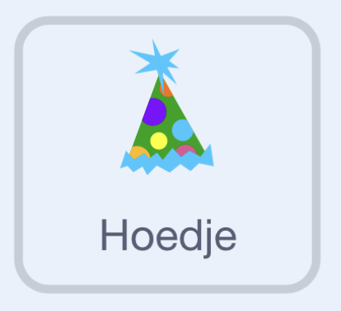

## Uitdaging

### Voeg een viering toe!

Voeg een feestmuts toe en speel een deuntje als een score is bereikt!

\--- task ---

Selecteer de **Hoed**-sprite. {:width="100px"}

\--- /task ---

\--- task ---

Als een score hoger dan (`>`) 200 wordt bereikt, verschijnt de Hoed-sprite en wordt er een geluid afgespeeld.

```blocks3
+when I receive [score v]
+forever
	if <(Score) > (200)> then // Try changing this score
    	show                              	
    	play sound [Dubstep v] until done 	// You can change the sound
	end
end
```

\--- /task ---

\--- task ---

Voeg resetcode toe.

```blocks3
+when [n v] key pressed
+hide
```

\--- /task ---

\--- task ---

**Test:** Druk op `N` en speel tot een score boven de 200. Controleer vervolgens of het hoedje verschijnt en of je het gekozen geluid hoort.

\--- /task ---

### Toon de spelbesturing

\--- task ---

Selecteer het speelveld en open het tabblad Achtergronden.

\--- /task ---

\--- task ---

Dupliceer de achtergrond 'Hill' en hernoem deze naar 'Besturing'.

\--- /task ---

\--- task ---

Voeg tekst toe aan de Besturings-achtergrond om te laten zien hoe je het spel bestuurt.

\--- /task ---

\--- task ---

Voeg dit ene codeblok toe aan het script 'wanneer toets n wordt ingedrukt'.

```blocks3
when [n v] key pressed
stop all sounds
set [Score v] to [0]
set [Power v] to [0]
set [Throws left v] to [3]
+switch backdrop to [Hill v]
show variable [Power v]
show variable [Score v]
show variable [Throws left v]
```

\--- /task ---

### Kies een andere Speler-sprite

\--- task ---

Kies de Speler-sprite en selecteer een nieuwe sprite uit de bibliotheek, ontwerp er zelf een, upload een afbeelding of selecteer een willekeurige sprite.

\--- /task ---

\--- task ---

Zorg ervoor dat je nieuwe sprite twee uiterlijken heeft: 'worp' en 'stilstaan', zodat de worp-animatie behouden blijft.

\--- /task ---
